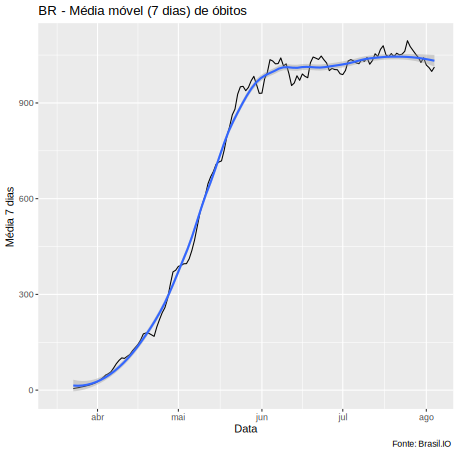
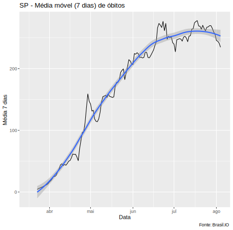
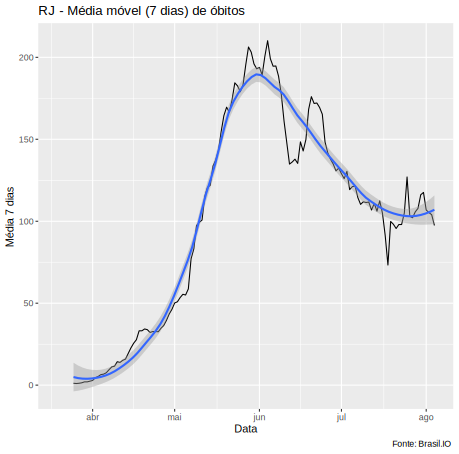
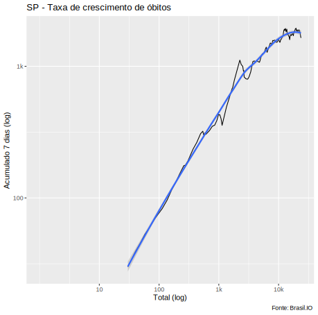
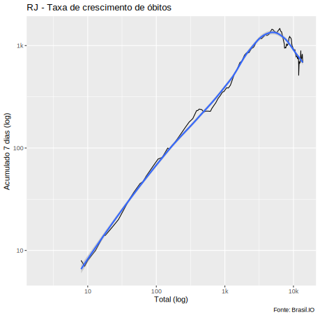
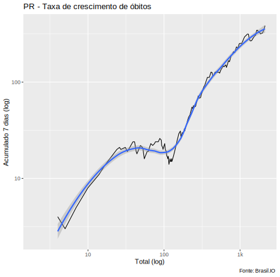

# Gráficos sobre a pandemia de COVID-19 no Brasil
Atualizados diariamente, se tudo correr bem :smile:

## 1 - Nacional e Estados Selecionados, Índice de Crescimento de Óbitos

## 2 - Capitais Selecionadas, Índice de Crescimento de Óbitos

## 3 - Nacional e Estados Selecionados, Médias Móveis (7 dias) de Óbitos

## 4 - Nacional e Estados Selecionados, Índice de Crescimento de Óbitos

